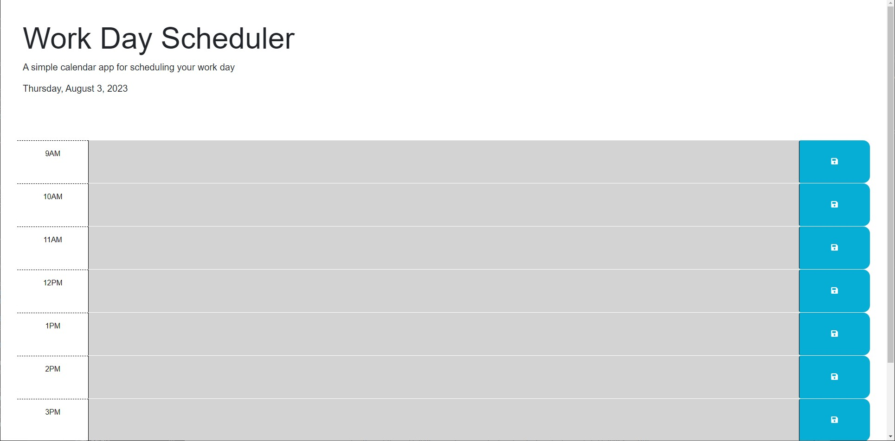

Day Planner/Calendar

Description
A basic day planner where you can add events to your day. It will tell you the current day and you are given a set of times to add events. Events/hours that have passed will be grayed out while current hour events will be read and future hours will be green.

Installation
N/A

Usage
To plan your day and give you access of the events that you have previously added. 

Credits
N/A

License
Please refer to the LICENSE in the repo.

https://github.com/physixkz/freddy-guerra-calendar

https://physixkz.github.io/freddy-guerra-calendar/